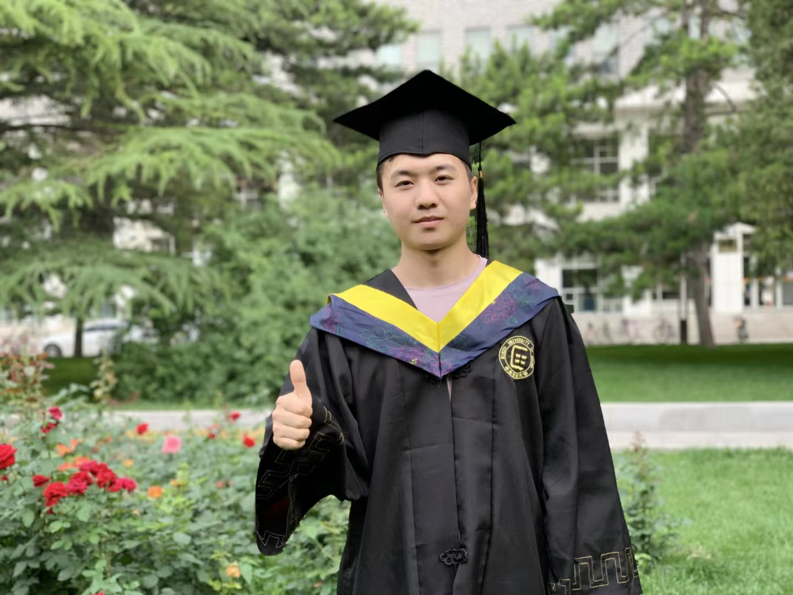

# Benjia Zhou, PhD, Macau University of Science and Technology

Email: zhou.benjia0228@gmail.com   [Goolge Scholar](https://scholar.google.com/citations?user=yAEKSn0AAAAJ&hl=zh-CN&oi=ao) [ResearchGate](https://www.researchgate.net/profile/Benjia-Zhou) [DBLP URL](https://dblp.org/pid/263/7275)

## Recent News

1. 2023-07: One paper about RGB-D action recognition was accepted by **ACM MM 2023**
2. 2023-07: One paper about Sign Language Translation (SLT) was accepted by **ICCV 2023**

## Biography

## Research Interests
Computer Vision · Deep Learning · Video Understanding · Motion Recognition · Sign Language Translation

## Selected Awards and Honors

## Publications

### Conference Papers (selected papers, [full paper list](https://scholar.google.com/citations?user=yAEKSn0AAAAJ&hl=zh-CN&oi=ao))

1. **Zhou, B.**, Chen, Z., Clapés, A., Wan, J., Liang, Y., Escalera, S., ... & Zhang, D. "Gloss-free Sign Language Translation: Improving from Visual-Language Pretraining", ICCV 2023.
2. Yujun Ma, **Benjia Zhou**, Ruili Wang, Pichao WANG, "Multi-stage Factorized Spatio-Temporal Representation for RGB-D Action and Gesture Recognition", ACM MM 2023.

### Journal Articles (selected papers, [full paper list](https://scholar.google.com/citations?user=yAEKSn0AAAAJ&hl=zh-CN&oi=ao))
1. **Benjia Zhou**, Pichao Wang, Jun Wan, Liangliang Yan, and Fan Wang, "A Unified Multimodal De-and Re-coupling Framework for RGB-D Motion Recognition", IEEE Transactions on Pattern Analysis and Machine Intelligence (TPAMI), 2023. [paper](https://arxiv.org/pdf/2211.09146.pdf) [code](https://github.com/zhoubenjia/MotionRGBD-PAMI)
2. Yu, Z., **Zhou, B.**, Wan, J., Wang, P., Chen, H., Liu, X., ... & Zhao, G. Searching multi-rate and multi-modal temporal enhanced networks for gesture recognition. IEEE Transactions on Image Processing (TIP), 2021.
