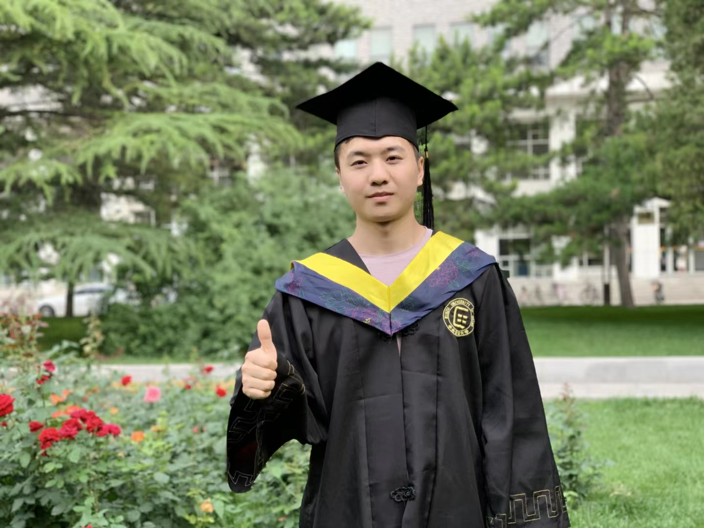

# Benjia Zhou

**Assistant Professor**, Beijing Institute of Technology, Zhuhai  
**Email:** zhou.benjia0228@gmail.com  
**Profiles:** [Google Scholar](https://scholar.google.com/citations?user=yAEKSn0AAAAJ&hl=zh-CN&oi=ao) · [ResearchGate](https://www.researchgate.net/profile/Benjia-Zhou) · [DBLP](https://dblp.org/pid/263/7275)

I received the Ph.D. degree in Artificial Intelligence and am currently an Assistant Professor with the Beijing Institute of Technology, Zhuhai. Previously, I was an AIGC Research Scientist with Tencent GY-Lab. My research interests include intelligent video analysis, spatio-temporal representation learning, multimodal learning, and AI-generated content (AIGC). I have published more than 15 papers in leading journals and conferences, including IEEE TPAMI, IEEE TIP, IEEE TCSVT, CVPR, ICCV, AAAI, and ACM Multimedia.

**Research Interests:** Intelligent Video Analysis · Spatio-temporal Representation Learning · Multimodal Learning · AI-generated Content (AIGC)

## Recent News

- **2025-03:** One article on gloss-free sign language translation was accepted by **TCSVT**.
- **2024-03:** One paper on gloss-free sign language translation was accepted by **COLING 2024**.
- **2023-07:** One paper on RGB-D action recognition was accepted by **ACM MM 2023**.
- **2023-07:** One paper on sign language translation was accepted by **ICCV 2023**.

## Publications

I have published more than 15 papers in leading journals and conferences. Selected papers are listed below. For the complete list, please see my [Google Scholar profile](https://scholar.google.com/citations?user=yAEKSn0AAAAJ&hl=zh-CN&oi=ao).

### Conference Papers

- Chen, Z., **Zhou, B.**, Li, J., Wan, J., Lei, Z., Jiang, N., ... & Zhao, G. "Factorized Learning Assisted with Large Language Model for Gloss-free Sign Language Translation." **COLING 2024**.
- **Zhou, B.**, Chen, Z., Clapés, A., Wan, J., Liang, Y., Escalera, S., ... & Zhang, D. "Gloss-free Sign Language Translation: Improving from Visual-Language Pretraining." **ICCV 2023**.
- Ma, Y., **Zhou, B.**, Wang, R., & Wang, P. "Multi-stage Factorized Spatio-Temporal Representation for RGB-D Action and Gesture Recognition." **ACM MM 2023**.
- **Zhou, B.**, Wang, P., Wan, J., Liang, Y., Wang, F., Zhang, D., ... & Jin, R. "Decoupling and Recoupling Spatiotemporal Representation for RGB-D-based Motion Recognition." **CVPR 2022**.
- **Zhou, B.**, Li, Y., & Wan, J. "Regional Attention with Architecture-rebuilt 3D Network for RGB-D Gesture Recognition." **AAAI 2021**.
- **Zhou, B.**, Wan, J., Liang, Y., & Guo, G. "Adaptive Cross-fusion Learning for Multi-modal Gesture Recognition." **VRIH 2021**.

### Journal Articles

- Zhigang C., **Zhou, B.**, Yiqing Huang, et al. "C2RL: Content and Context Representation Learning for Gloss-free Sign Language Translation and Retrieval. **IEEE Transactions on Circuits and Systems for Video Technology**, 2025.
- **Zhou, B.**, Wang, P., Wan, J., Yan, L., & Wang, F. "A Unified Multimodal De- and Re-coupling Framework for RGB-D Motion Recognition." **IEEE Transactions on Pattern Analysis and Machine Intelligence (TPAMI)**, 2023.
- Yu, Z., **Zhou, B.**, Wan, J., Wang, P., Chen, H., Liu, X., ... & Zhao, G. "Searching Multi-rate and Multi-modal Temporal Enhanced Networks for Gesture Recognition." **IEEE Transactions on Image Processing (TIP)**, 2021.

## Awards and Honors

- Second Prize, IEEE Finland Jt. Chapter SP/CAS Best Paper Award, 2022.
- 2nd Place, [HEART-MET Gesture Recognition and Activity Recognition Challenges](https://metricsproject.eu/news/heart-met-challenges-results-1/).
- 4th Place, [ICIAP Multimodal Action Recognition Competition](https://iplab.dmi.unict.it/MECCANO/challenge.html).

## Academic Service

**Conference Reviewer:** CVPR, AAAI, IJCAI, ACM MM, FG  
**Journal Reviewer:** IEEE TIP, IEEE TMM, IJCV, IEEE TCSVT, CIBM, JMIR
